# Ali Baba and The Forty Thieves

[Ali Baba and the Forty Thieves](https://en.wikipedia.org/wiki/Ali_Baba_and_the_Forty_Thieves) is a famous tale from *One Thousand and One Nights* (*Arabian Nights*). Ali Baba, a poor woodcutter, accidentally discovers a hidden cave belonging to a group of thieves. He overhears their leader say the magic words, “Open, Simsim!” (or “Open Sesame!”), to reveal a treasure-filled cavern. After the thieves leave, Ali Baba enters, takes some treasure, and returns home.

The story originates from the medieval *Arabic One Thousand and One Nights*, though it was likely added by the French translator Antoine Galland in the 18th century. It reflects Middle Eastern oral storytelling traditions, emphasizing themes of fate, cleverness, and moral justice. The tale has endured as a classic of folklore, influencing literature, films, and popular culture worldwide.

## This Project

This project demonstrates authenticating against Okta (auth0.com) using their free developer accounts.  

The Angular SPA (`ui/ng-ui`) has both protected and unprotected routes, and will redirect to auth0.com login page.  Once a JWT is obtained, it will use that for calling protected services (`services/*`).

The services (Spring or Quarkus) serve an unprotected endpoint (`/public`), mainly to deliver application configuring to the client ui app.  Other resources (`/api`) are protected, and use the configured Auth0 Client Domain as the issuer URI for validating the JWT token.

## Okta/Auth0

Head over to [okta.com](https://okta.com)/[auth0.com](https://auth0.com) and create a developer account.  

<details>
  <summary>Expand to view Auth0/Okta application setup</summary>

### Create Auth0 Application

Once in your dashboard, create a new appliatiom for "single-page applications."

`Applications`->`Applications`->`Create Application`

* Name: `Ali Baba's Secret Treasure`

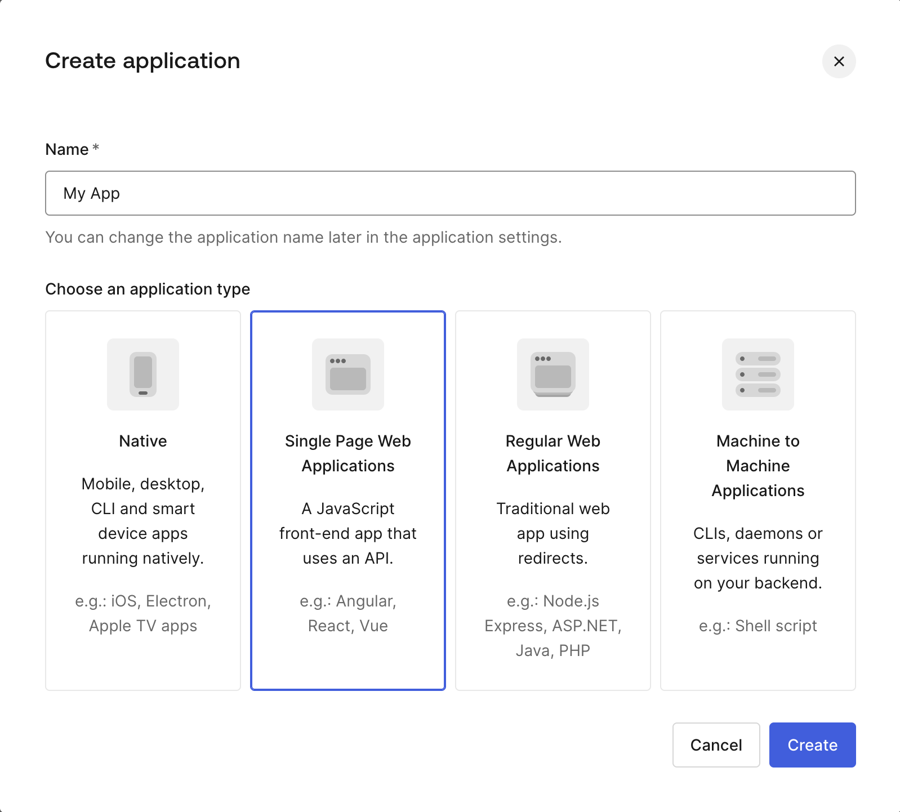

### Select Angular

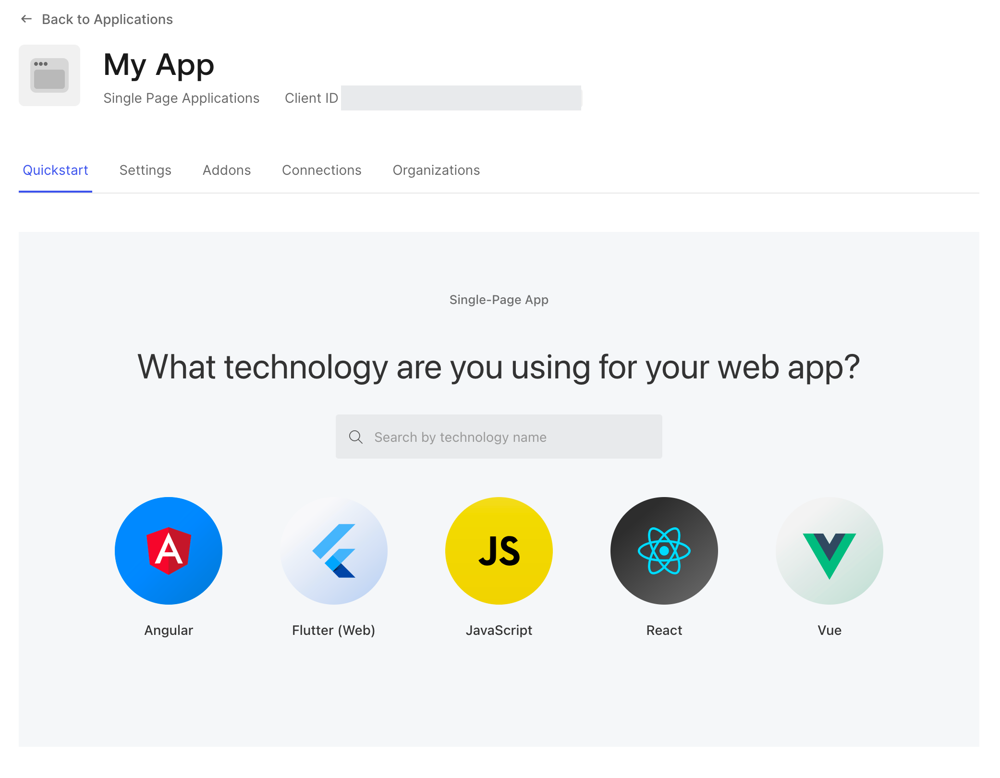

### Auth0 App Settings

Read more from [Auth0's Documentation](https://auth0.com/docs/quickstart/spa/angular/interactive)

> [!WARNING]  
> When using the Default App with a Native or Single Page Application, ensure to update the Token Endpoint Authentication Method to None and set the Application Type to either SPA or Native.

### Configure Callback URLs

* **Allowed Callback URLs**: `http://localhost:4200`
* **Allowed Logout URLs**: `http://localhost:4200`
* **Allowed Allowed Web Origins**: `http://localhost:4200`

Make note of the following information, which you'll need to configure the services and Angular applications.

* **Domain**
* **Client ID**

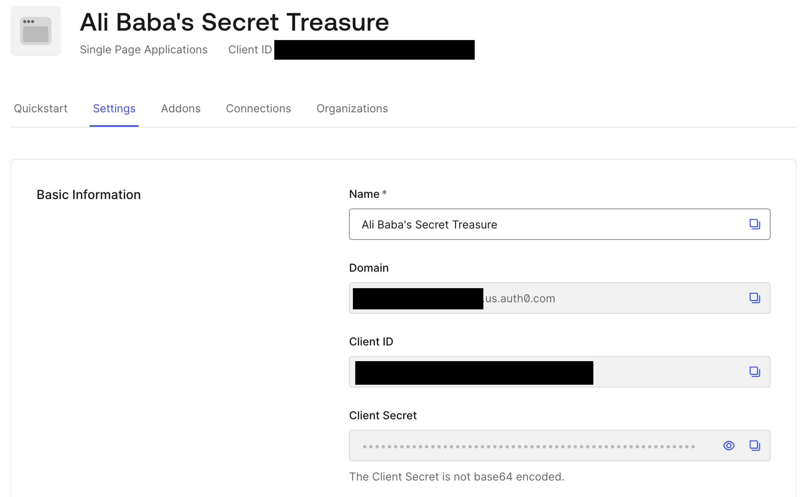

### Create and Configure API

`Applications`->`API`->`Create API`

* Name: `ali-baba`
* Identifier: `http://localhost:4200/api`

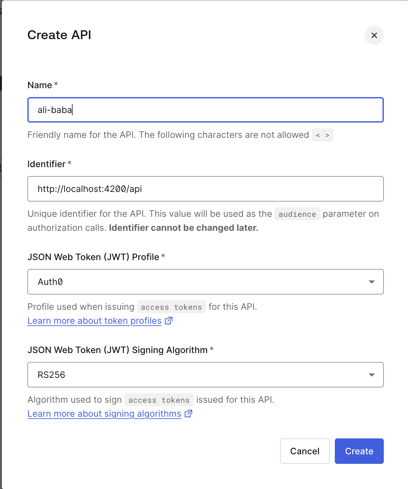

Add the following permissions:

* `see:thieves-treasure`
* `see:alibaba-treasure`
* `take:thieves-treasure`

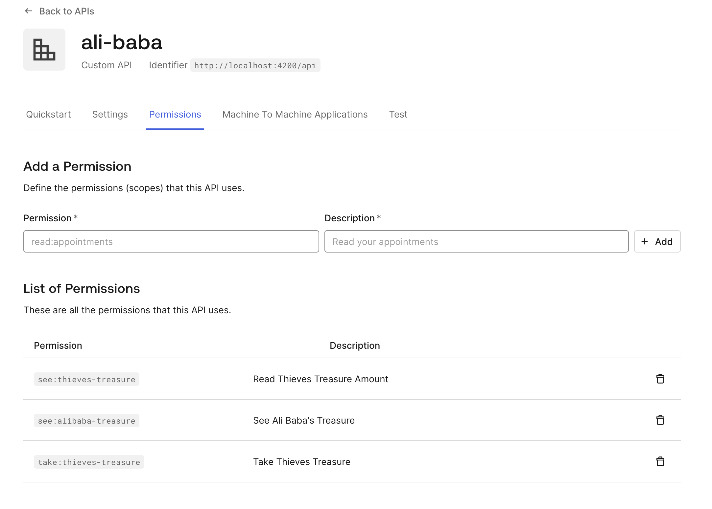

Make note of the `Identifier`/`audience`.

### Create Role

`User Management`->`Roles`->`Create Role`

* Name: `treasure-hunter`

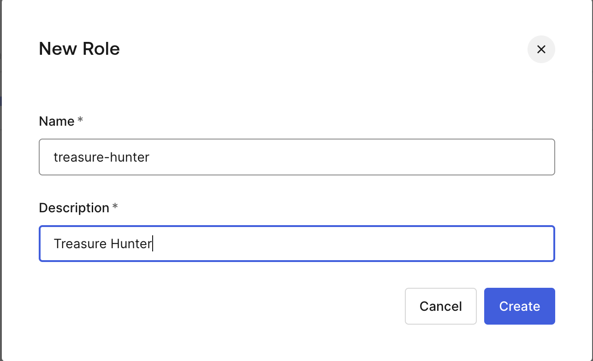

Add API permissions to roles:


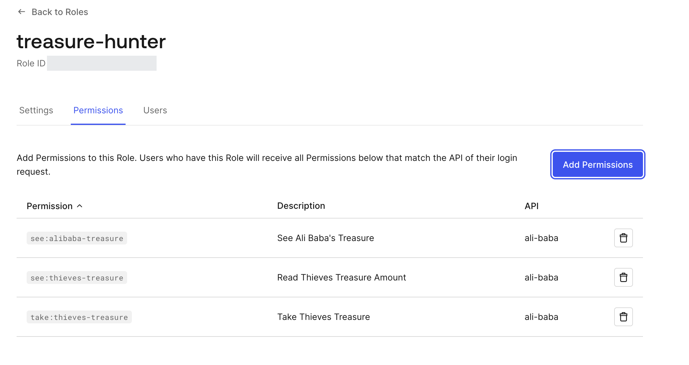

### Create User

`User Management`->`Users`->`Create User`

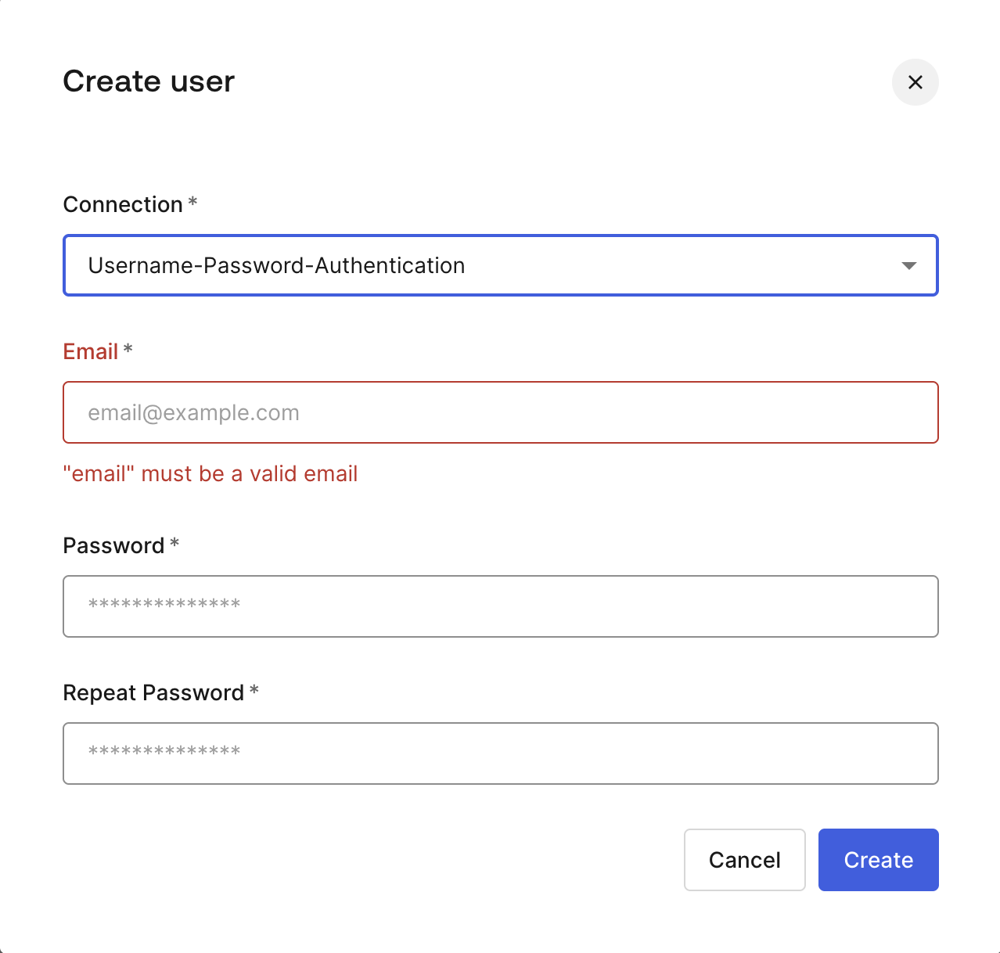

Assign User Roles:

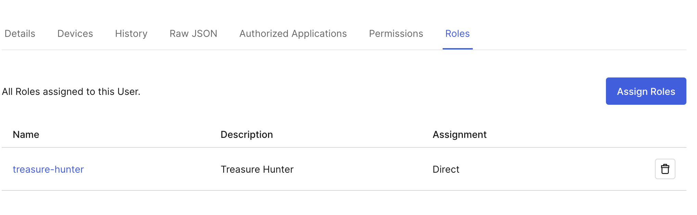

View inherited permissions:

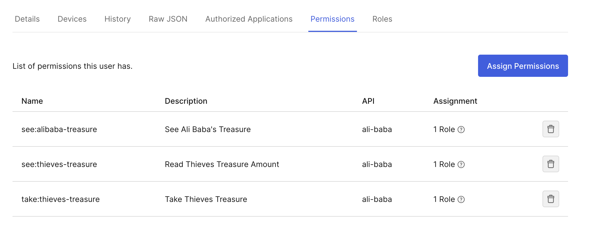

### Create Login Trigger Action

A login trigger is needed to modify the tokens to include the user roles, otherwise the tokens will only contain permissions.  Read more about adding roles in Auth0's documentation [Add user roles to tokens](https://auth0.com/docs/manage-users/access-control/sample-use-cases-actions-with-authorization#add-user-roles-to-tokens).

`Actions`->`Trigger`->`post-login`


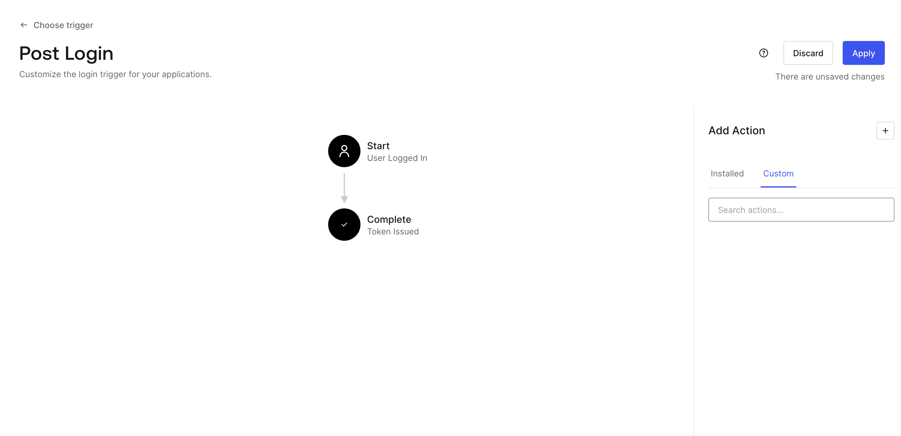

Add Action, choose `Build from scratch`:

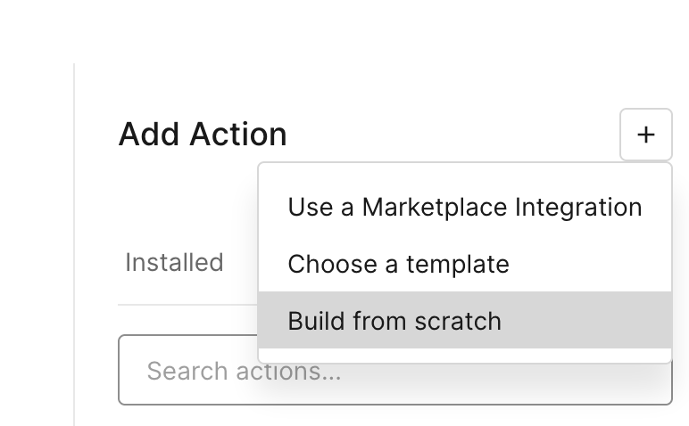

Create Trigger Action:

* Name: `Add Roles To Tokens`
* Trigger: `Login / Post Login`
* Runtime: Recommended Node version

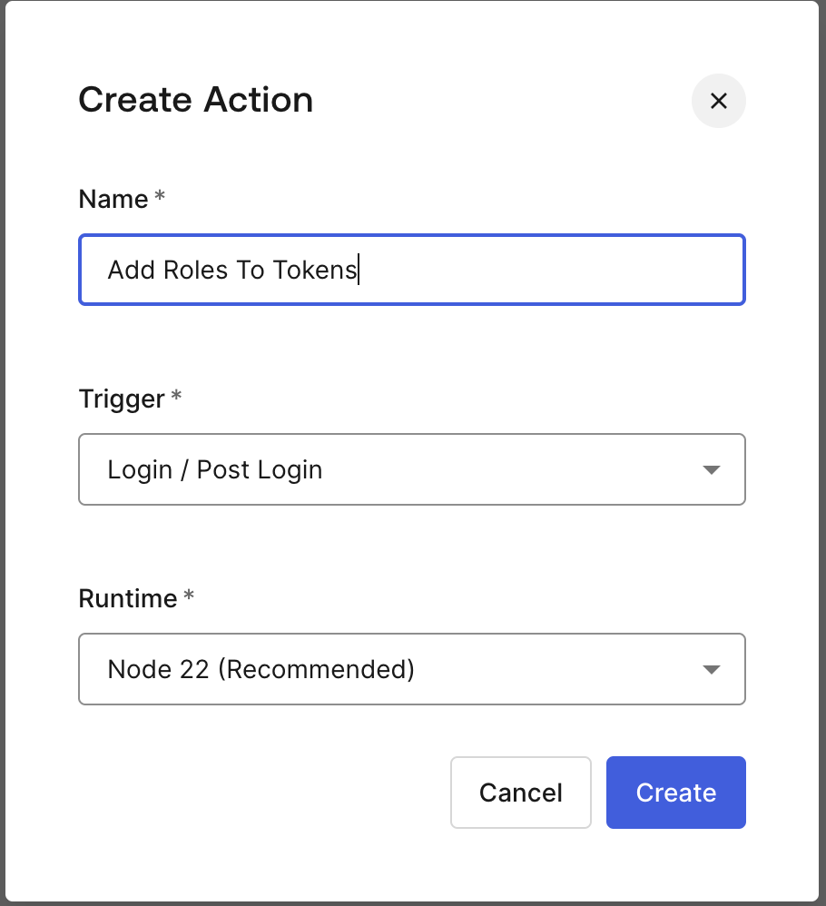

Past the following code, but that the `namespace` with whatever you want:

```javascript
exports.onExecutePostLogin = async (event, api) => {
  const namespace = 'your-namespace.example.com'; // Can be anything
  if (event.authorization) {
    api.idToken.setCustomClaim(`${namespace}/roles`, event.authorization.roles);
    api.accessToken.setCustomClaim(`${namespace}/roles`, event.authorization.roles);  
  }
}
```

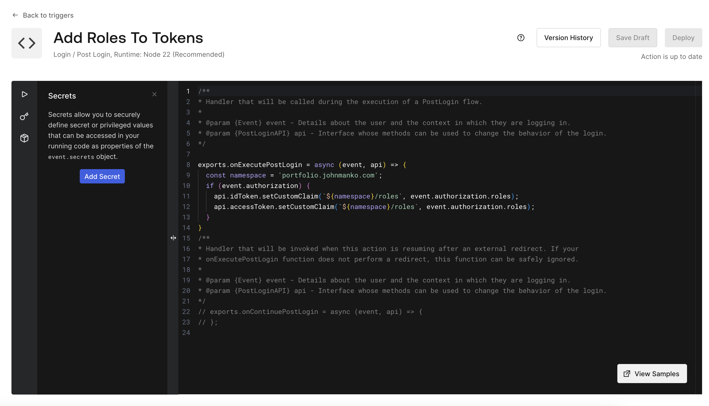

After you save, the action wil appear to right of the Post Login trigger pipeline.  Drag-and-drop it to the pipeline:

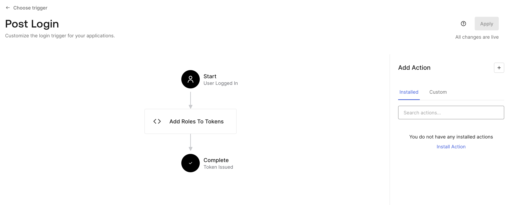

Save changes.

</details>

## Running Services

Rename `./scripts/auth0-config-sample.sh` to `./scripts/auth0-config.sh` and set the configurations used/generated with the Auth0 configuration:

```shell
AUTH0_DOMAIN="client-domain"
AUTH0_EMAIL="email@example.com"
AUTH0_PASSWORD="yourpassword"
AUTH0_AUDIENCE="identifier (audience)"
AUTH0_CLIENT_ID="client-id"
```

### Spring Boot

Following instructions at [./services/spring-boot-ali-babas-secret/README.md](./services/spring-boot-ali-babas-secret/README.md)

